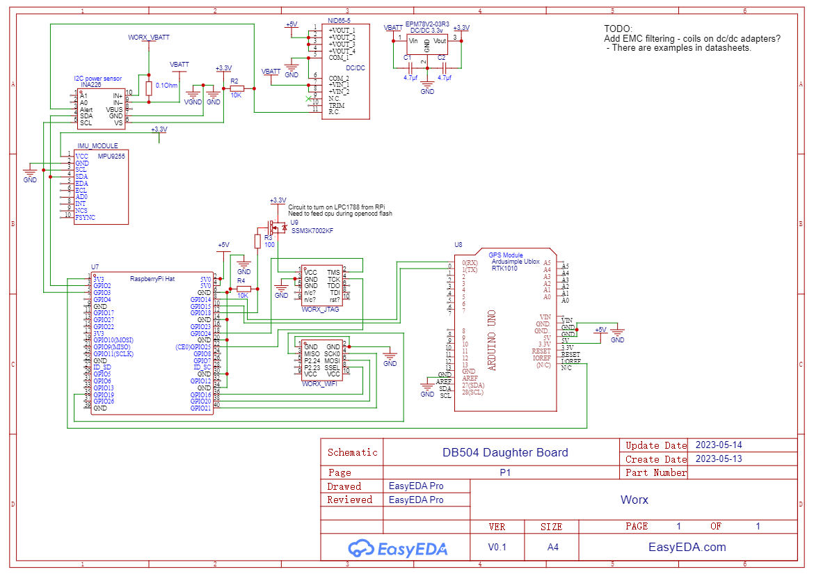

## Table of Contents

TBD


## Hardware
Pinout and connections for this to work. I personally use a Raspberry pi zero 2 w with zram enabled (not only swapfile). Compilation of ROS is made on an rpi4 and then rsync over to the rpi zero w 2.
I also have a 4g modem for connectivity. I have put the INA226 on the thick red wire to the board (cut).


General schematic, work in progress. Made from memory - no guarantee it is working!


Note code for setting up INA226 is missing at the moment, this needs to be programmed every start and should be done in a i2c module we need to write. This module should also handle the MPU9255 for the IMU data to ROS. TBD


* ROS enviroment
Follow and install https://wiki.openmower.de/index.php?title=System_Image but stop before `Installing OpenMower Software`
```
git clone --recursive https://github.com/ClemensElflein/open_mower_ros.git

git clone https://github.com/Damme/LandLord

# MPU9255
cd open_mower_ros/src
git clone https://github.com/mdleiton/MPU9255
# We need to patch MPU9255 - in future the goal is to remove this dependency.
patch -d src/MPU9255/src/ < ../LandLord/ROS/MPU9255_node.cpp.diff

# Get rosdep, only needed once
sudo apt install --no-install-recommends python3-rosdep
sudo rosdep init
rosdep update

# Get the dependencies using rosdep
rosdep install --from-paths src --ignore-src --simulate | sed --expression '1d' --expression 's/apt-get install/apt-get install --no-install-recommends --yes/g' | bash

# WORX_COMMS
cp -r ../LandLord/ROS/src/worx_comms/ src/

# mower_simulation does now build, we dont need it
rm -rf src/mower_simulation/

# lets build it, it you have more than 4GB of ram you can use -j2 for faster build, this will take a while..
catkin_make -j1

# Copy the default configuration file to your home directory
cp src/open_mower/config/mower_config.sh.example ~/mower_config.sh

# edit and setup mower_config.sh and set OM_MOWER="Worx"
# uncomment last line of mower_config.sh 

cp -R ../LandLord/ROS/src/open_mower/params/hardware_specific/Worx/ src/open_mower/params/hardware_specific/

patch -d src/open_mower/launch/ < ../LandLord/ROS/open_mower.launch.diff
patch -dsrc/open_mower/launch/include/ < ../LandLord/ROS/_comms.launch.diff
cp ../LandLord/ROS/src/open_mower/launch/include/imu.launch src/open_mower/launch/include/

# The next step is to also source the OpenMower ROS install
# If you're using bash (default on Ubuntu):
echo "source /home/ubuntu/open_mower_ros/devel/setup.sh" >> ~/.bashrc
echo "source /home/ubuntu/mower_config.sh" >> ~/.bashrc
source ~/.bashrc

# Else if you're using zsh
echo "source /home/ubuntu/open_mower_ros/devel/setup.zsh" >> ~/.zshrc
echo "source /home/ubuntu/mower_config.sh" >> ~/.zshrc
source ~/.zshrc

#### Worx firmware
# install arm-none-eabi-gcc https://developer.arm.com/downloads/-/gnu-rm
cd ..
wget https://developer.arm.com/-/media/Files/downloads/gnu-rm/10.3-2021.10/gcc-arm-none-eabi-10.3-2021.10-aarch64-linux.tar.bz2
sudo tar -xvf gcc-arm-none-eabi-10.3-2021.10-aarch64-linux.tar.bz2 -C /usr/share/
sudo ln -s /usr/share/gcc-arm-none-eabi-10.3-2021.10/bin/arm-none-eabi* /usr/bin/

make cpu=1788 #for db504 (the only board that is working atm)
# flash with openocd, openocd-flash.cfg
# note you will need to hold down power button to flash with openocd.
# it is also possible to flash with usb, the original boot loader is kept intact so rollback and usb flashing is possilbe.
# use create_bin.py to generate binary to put on usb stick.
```


## TODOOOOOOO
Known things that needs implemtentation
* Working emegancy stop and communication to ROS and reset emergancy stop
* internal tilt sensor emergancy stop if z val < threashold (mower leaning too much, upside down, standing on its side/back)

* For some reason sensor_Task just stops running. - I do not know what line of code is halting, I think the problem is xSensorQueue. We are using it as a global struct and xQueuePeek + xQueueOverwrite and this is not used as intended. Rewrite this to use a global struct instead and xSemaphore to prevent race conditions...

* BUG - Investigate the relationship with CHARGER_CHECK, CHARGER_CONNECTED, CHARGER_ENABLE, MOTOR_MOSFET. It seems we need both MOTOR_MOSFET and CHARGER_CHECK enabled to get a reading on CHARGER_CONNECTED. Make powermgmt.c more reliable. I still want to keep the "keep alive charger" function. since the mower standby voltage is so much higher I still want to re-enable charging. Pulse the CHARGER_ENABLE for 10ms every 500ms is enough to make the charger being kept in "red" state.

* investigate what sensor actually does what function naming might be wrong - SENSOR_STUCK, SENSOR_STUCK2, SENSOR_LIFT, SENSOR_COLLISION
* Full stop when collision detected. Block forward motion - and then? ROS has no way to handle this event yet.
* Lift sensor - no function

* Better readme - The first person setting up the enviroment PLEASE take notes! I am available on discord in the worx-landroid channel. https://discord.com/channels/958476543846412329/1092896540907032696